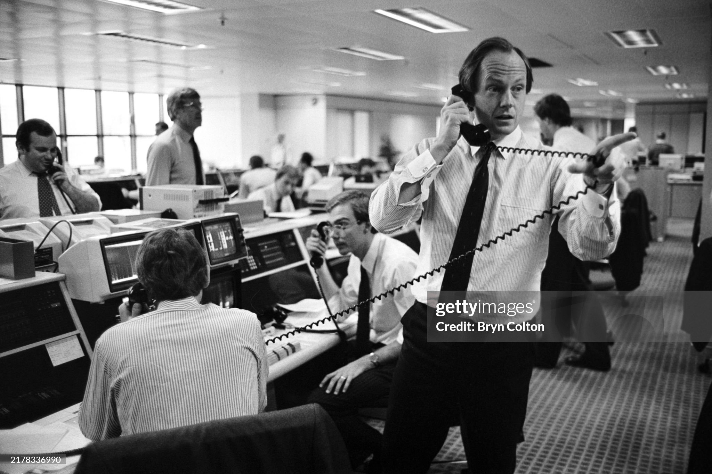
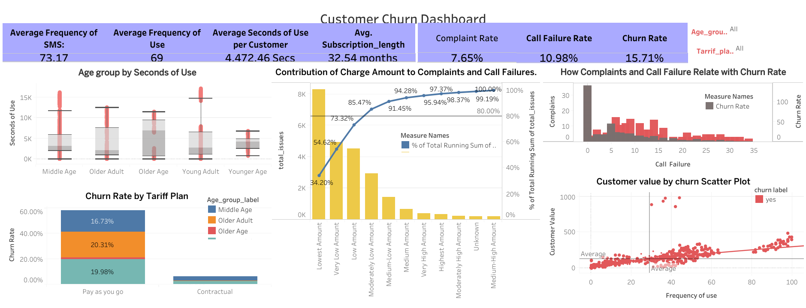

# Telecom-Customer-Churn-Project

## 1.	Introduction:
Customer churn poses a significant challenge for telecom companies, directly affecting revenue and the costs associated with retaining customers. This project analyzes customer churn data from an Iranian telecom provider, aiming to identify the main factors contributing to churn and offering practical recommendations to lower churn rates. By examining variables such as call failures, complaints, subscription duration, and customer value, this project intends to guide business strategies that enhance customer satisfaction and retention. 
Customer churn analytics ultimately enables telecom service providers to leverage a wealth of information and turn it into data-driven actions that drive growth, maximize customer retention rates and minimizes operational expenses. So, having it as a part of the strategy is important for business in any kind of market where competition exists. 
This project intends to solve the following objectives: 
-(i) Identify Key Drivers of Churn
-(ii) Identify Key Drivers of Churn 
-(iii) Retain High-Value Customers. 
By doing this, business can spot who's likely to leave and try to keep their best customers around. It's all about keeping people happy with the service so they stick around longer. The main idea is to have fewer customers leaving and more staying loyal to the company.

## 2.	Statement of Problem: 
The Iranian telecom provider is facing high churn rates, particularly among customers using the Pay As You Go tariff plan. Notably, there is a significant churn rate within the middle-aged and young adult demographics. 
The primary business challenges identified include: 
-i.	To address high churn rates by examining KPIs like Complaint Rate, Call Failure Rate, and Churn Rate, providing insights into service quality and customer behavior to help reduce attrition and improve satisfaction.
-ii.	How can churn be reduced among middle-aged and young adult customers? 
-iii.	What are the main factors driving churn (e.g., call failures, complaints), and how can these issues be resolved?
-iv.	How can the company retain high-value customers who are also at risk of churning? 

## 3.	Data Descriptions

### i. Variable Identification:
• Churn (1 = churn, 0 = non-churn) • Predictor Variables: o Call Failures: Total number of call failures.
•	Call Failures: The total number of call failures experienced. 
•	Complaints: A binary indicator showing whether a customer has made a complaint.
•	Subscription Length: The total duration of a customer's subscription measured in months.
•	Customer Value: A calculated metric that reflects the overall value of the customer. 
•	Tariff Plan: A binary variable indicating the type of plan (1 = Pay As You Go, 2 = Contractual). 
•	Age Group: An ordinal variable categorizing the customer's age (1: younger age, 5: older age). 
•	Charge Amount: ordinal attribute (0: lowest amount, 9: highest amount)
•	Seconds of Use: total seconds of calls
•	Frequency of use: total number of calls
•	Frequency of SMS: total number of text messages
•	Distinct Called Numbers: total number of distinct phone calls
•	Status: binary (1: active, 2: non-active)
•	Age: age of customer.

### ii. Aggregated Metrics:
Below are the aggregated measures to make sure the objectives of the project are achieved. Tey are : Average Frequency of SMS. Average Frequency of Use, Average Seconds of Use per Customer, Avg. Subscription length, Complaint Rate, Call Failure Rate, Churn Rate, Revenue of Active Customers, and  Revenue of Churned Customers

## 4.	Skills and Concepts Demonstrated:
This project showcased the following skills and concepts in data analytics: 
i.	Data Cleaning and Preparation: Handling missing data and ensuring data integrity.
ii.	Descriptive Analytics: Analyzing the distribution of key variables like churn, complaints, call failures, and customer value. 
iii.	Exploratory Data Analysis (EDA): Utilizing visual tools such as Pareto charts, box plots, and scatter plots to identify trends in the data. 
iv.	Correlation Analysis: Exploring the relationships between important variables like customer value, call failures, and churn. 
v.	Predictive Modeling: Gaining insights into customer behavior through basic modeling techniques (e.g., scatter plots). 
vi.	Data Visualization: Developing clear and actionable visual representations of the data to support business decisions. 

### Data Visualization - Dashboard using Tableau 

## 5.	Insights and Analysis:  
### i.	Key Performance Indicators:
Average Frequency of SMS: 73.17	
Average Frequency of Use: 69
Average Seconds of Use per Customer: 4,472.46 Secs           
 Avg. Subscription_length: 32.54 months
Complaint Rate: 7.65%
Call Failure Rate: 10.98%		
Churn Rate: 15.71%

### ii.	Churn by Tariff Plan and Age Group 
• Pay As You Go Plan: o The highest churn rates were seen among middle-aged (16.73%) and young adult (19.98%) customers. Older adults also showed a notable churn rate at 20.3%, while the oldest age group had the lowest churn rate at 1.27%. 
• Contractual Plan: Churn rates were significantly lower, with middle-aged (3.23%) and young adult (2.23%) customers experiencing the least churn.
 Interpretation: 
 The elevated churn rates among middle-aged and young adult customers on the Pay As You Go plan indicate potential dissatisfaction or a tendency to switch to competitors. In contrast, the lower churn rates in contractual plans suggest higher customer retention and satisfaction.
### iii.	Call Failures and Complaints 
• There was a positive correlation between call failures, complaints, and churn, highlighting issues with service quality. Customers with lower charge amounts were particularly prone to these problems.
 Interpretation:  
Addressing call failures and enhancing customer support could lead to a notable decrease in churn rates. Targeting interventions towards customers with low charge amounts may yield better results.
### iv.	Customer Value and Frequency of Use 
• Most churned customers were low-value, but there were also high-value customers who churned, indicating a positive relationship between customer value and usage frequency. 
Interpretation: 
The loss of high-value customers represents a significant hit to the business. Although they are fewer in number, these customers should be prioritized in retention strategies due to their greater impact on revenue. 

## 6.	Conclusion:
 The analysis identified several key factors affecting customer churn in the telecom company: • Pay As You Go customers, especially those who are middle-aged and young adults, face the highest churn rates, often linked to call failures, complaints, and dissatisfaction with low charge amounts. 
• While low-value customers make up the bulk of churn statistics, a smaller group of high-value churned customers poses a considerable revenue loss for the company.
Summary of Findings:
•	Call failures and complaints show a positive correlation with churn
•	plot illustrating customer value against usage frequency among churned customers indicated a positive correlation, highlighting that some high-value customers are at risk of churning. 
•	20% of customers are responsible for 80% of the complaints and call failures, particularly those in the lower charge amount categories (i.e., "low" and "very low").
•	Observation was also made that churn and call failures exhibit a different trend—when call failures decrease, churn rate declines (This could be due to several potential reasons: (Customer Tolerance or Expectation Management, Service Compensation or Recovery)
•	Customers who did not experience call failures but still had complaints might have unsubscribed (churned). This implies that even if the technical quality of the service (e.g., call failures) was good, there were other issues causing dissatisfaction, leading these customers to unsubscribe. 
•	There is a positive correlation between customer value and usage frequency among churned customers. This suggests that while the majority of churned customers are low-value, there are notable high-value exceptions that contribute to the overall positive correlation. 
•	that the older age category had the highest median and upper hinge values for seconds of use, even though it did not have the highest maximum value. 

## 7. Recommendation 
### i. Enhance Retention for Pay As You Go Customers: 
•	Create targeted loyalty programs and incentives aimed at keeping middle-aged and young adult customers engaged. 
•	Look into possible service issues and pricing concerns affecting these demographics. 
### ii.  Minimize Call Failures and Complaints: 
•	Prioritize addressing service quality problems related to call failures, particularly for customers with lower charge amounts. 
•	Bolster customer support channels to resolve complaints proactively, preventing potential churn. 
### iii. Concentrate on Retaining High-Value Customers: 
•	Focus on high-value customers who have churned by implementing personalized retention campaigns to avoid revenue loss. - Provide loyalty rewards and tailored incentives to foster ongoing engagement.
•	Encourage Contractual Plans: - Actively promote the contractual plan to Pay As You Go customers, particularly those in high-risk churn categories like middle-aged and young adults. Offering appealing incentives for switching plans could further help in reducing churn.
